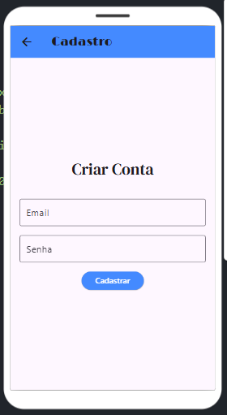
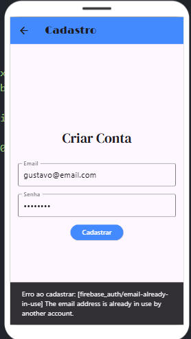
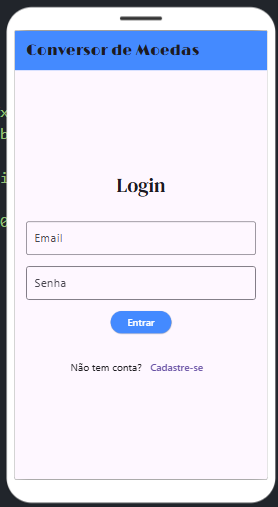
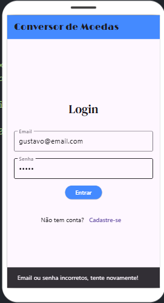
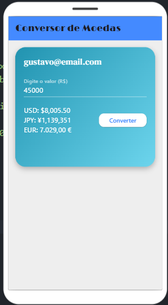
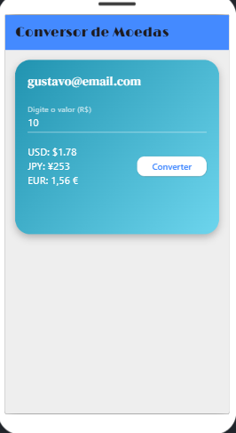

# 💱 Conversor de Moedas Flutter

Um aplicativo Flutter simples e funcional para conversão de moedas em tempo real. O projeto utiliza autenticação com Firebase e consome a API da [CurrencyFreaks](https://currencyfreaks.com/) para realizar as conversões. A interface simula um cartão digital com valores convertidos em três moedas distintas.

---

## 🔧 Funcionalidades

- Cadastro e login de usuários com Firebase Authentication.
- Conversão de moedas utilizando a [API CurrencyFreaks](https://currencyfreaks.com/).
- Interface de cartão de crédito digital com:
  - Nome do usuário (e-mail).
  - Valor digitado para conversão.
  - Conversões exibidas em USD, EUR e JPY.
- Layout responsivo e estilizado com Flutter.

---

## 📦 Dependências

- `firebase_core`
- `firebase_auth`
- `http`
- `google_fonts`
- `intl`

---

## 🚀 Como executar

### 1. Clonar o repositório

```bash
git clone https://github.com/gustavorsc/conversor-moedas-flutter.git
cd conversor-moedas-flutter
```

### 2. Instalar as dependências

```bash
flutter pub get
```

### 3. Configurar o Firebase

- Crie um projeto no [Firebase Console](https://console.firebase.google.com/).
- Ative a autenticação por e-mail/senha.
- Baixe o arquivo `google-services.json` e adicione na pasta `android/app`.
- Configure `firebase_options.dart` com seu projeto.

### 4. Rodar o app

```bash
flutter run
```

---

## 🌍 API de Conversão

Este projeto utiliza a [CurrencyFreaks API](https://currencyfreaks.com/) para obter taxas de câmbio em tempo real.

### Exemplo de requisição:

```
GET https://api.currencyfreaks.com/latest?apikey=SUA_API_KEY&symbols=USD,EUR,JPY
```

### Parâmetros:

- `apikey`: Sua chave de API (obtida gratuitamente no site).
- `symbols`: Moedas que deseja converter.

---

## 🖼️ Layout

O aplicativo exibe um "cartão de crédito digital" na parte superior da tela com:

- Nome (e-mail do usuário autenticado).
- Valor digitado para conversão.
- Conversões exibidas na lateral direita.

---

## 📷 Capturas de Tela

Adicione abaixo as imagens das principais telas do aplicativo:

### Tela de Cadastro

### Tentativa de Cadastro com email já utilizado


### Tela de Login

### Aviso de senha ou email incorreto


### Tela Home (Cartão Digital)

### Tela Home com a conversão executada



---

## Link APK
- https://flutlab.io/apk/aHR0cHM6Ly9hcGkuZmx1dGxhYi5pby9wcm9qZWN0cy8yNTQzMTMyL2Rvd25sb2FkLWFwcD9rZXk9NHc3ZnJjbTZvMDZ3d3hiM21sY24mdGFyZ2V0PWFuZHJvaWQtYXJtNjQ=

## 👨‍💻 Autor

Desenvolvido por [Gustavo Rodrigues Soares Costa] – 2025  
Estudante do 5º Semestre de Engenharia de Software - UniFACEF
Entre em contato: [gugwqh@gmail.com]
